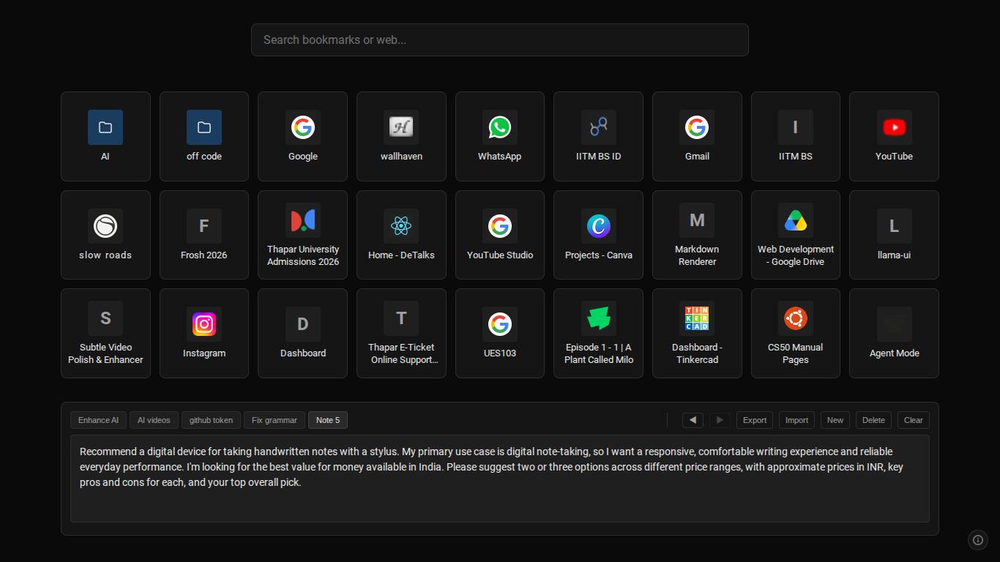
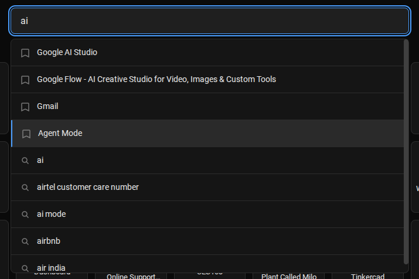
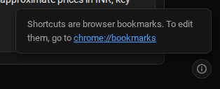

# Custom New Tab

A minimal, performance-optimized dark-themed homepage for your browser. This extension replaces the default new tab page with a clean interface featuring search, bookmarks, and a notes area.

## Screenshots

### Homepage Overview

### Search Suggestions

### Bookmarks Info Tooltip

## Features

- **Minimalist Design**: Dark-themed, distraction-free interface.
- **Fast Search**: Integrated search bar with Google search suggestions and bookmark results.
- **Bookmarks Integration**: Quick access to your browser bookmarks in a clean grid layout.
- **Persistent Notes**: A built-in notes area that saves automatically to your browser's local storage.
- **Performance Optimized**: Designed for low-end devices with minimal overhead, no heavy animations, or blur effects.

## Installation

To install this extension in Chrome or any Chromium-based browser (Edge, Brave, etc.):

1. Download or clone this repository to your local machine.
2. Open your browser and navigate to `chrome://extensions/`.
3. Enable **Developer mode** by toggling the switch in the top right corner.
4. Click on **Load unpacked**.
5. Select the folder containing the extension files.

## Usage

- **Search**: Start typing in the search box to see suggestions. Press `Enter` to search on Google.
- **Bookmarks**: Click on folders to navigate through your bookmarks.
- **Notes**: Type anything in the notes area; it will be saved automatically and persist across new tabs.

## Permissions

This extension requires the following permissions:
- `bookmarks`: To display and search your browser bookmarks.
- `https://suggestqueries.google.com/*`: To provide search suggestions as you type.
